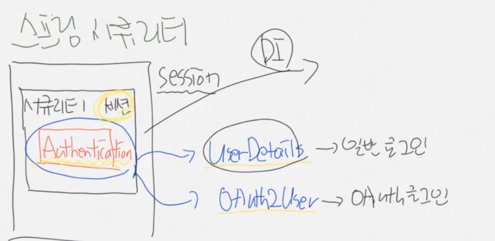
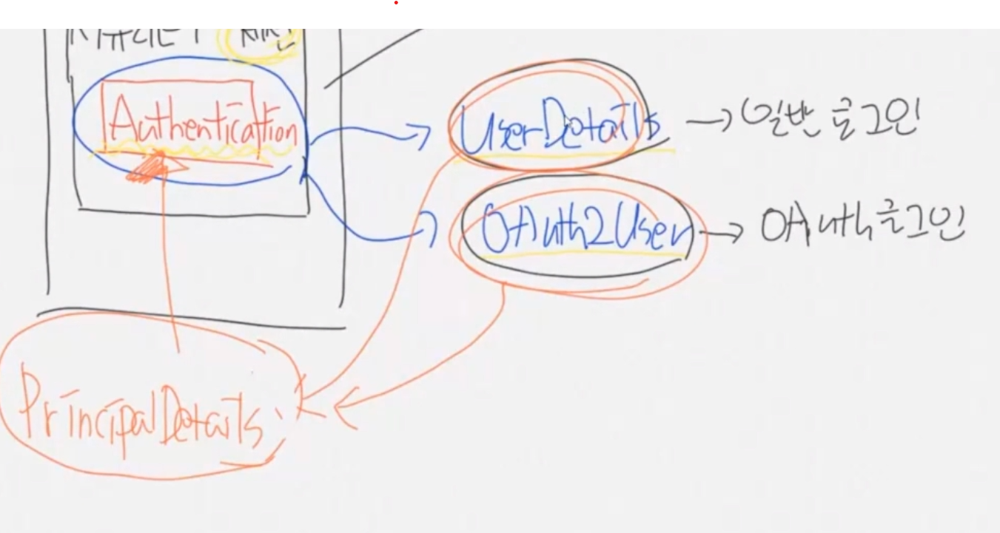

``` java
@EnableMethodSecurity(securedEnabled = true, prePostEnabled = true) // secured 어노테이션 활성화, preAuthorize,postAuthorize 어노테이션 활성화
// EnableMethodSecurity 글로벌 붙은거 사라짐

@Secured("ROLE_ADMIN")
@GetMapping("/info")
public @ResponseBody String info(){
    return "개인정보";
}

@PreAuthorize("hasRole('ROLE_MANAGER') or hasRole('ROLE_ADMIN')")
@GetMapping("/data")
public @ResponseBody String data(){
    return "데이터정보";
}
```


---

## 구글 콘솔 api 

oAuth: open Auth

리소스 오너
클라이언트
인증 서버
리소스 서버

https://console.cloud.google.com/

사용자 인증정보 -> 만들기


```html

<a href="/oauth2/authorization/google">구글 로그인</a>

/oauth2/authorization/google 마음대로 바꿀수없음

```


```java

.oauth2Login(login ->
    login
    .loginPage("/loginForm") // 구글 로그인이 완료된 뒤의 후처리가 필요함
    .defaultSuccessUrl("/" , true)
    );

```

### 구글 로그인 후처리

```java

@Service
public class PrincipalOauth2UserService extends DefaultOAuth2UserService {

    // 구글로 부터 받은 userRequest 데이터에 대한 후처리되는 함수
    @Override
    public OAuth2User loadUser(OAuth2UserRequest userRequest) throws OAuth2AuthenticationException {
        System.out.println("userRequest: "+userRequest.getClientRegistration());
        System.out.println("userRequest: "+userRequest.getAccessToken().getTokenValue());
        System.out.println("userRequest: "+super.loadUser(userRequest).getAttributes());
        return super.loadUser(userRequest);
    }
}
```

데이터 정보 ->
sub=100325407570986432096, 
name=윤원용, 
given_name=원용, 
family_name=윤, 
picture=https://lh3.googleusercontent.com/a/ACg8ocJXEu-jiyOVHobij5qdclFfv9krmQcVhXl9tqA0n6si=s96-c, 
email=2dawit70@gmail.com, 
email_verified=true, 
locale=ko


username = "google_100325407570986432096"
password = "암호화(겟인데어)"
email = "2dawit70@gmail.com"
role = "ROLE_USER"
provider = "google"
providerId = "100325407570986432096"

### Authentication 객체의 두가지 타입






UserDetails, OAuth2User -> PrincipalDetails를 부모로두고 Authentication에 넣어서쓰면됨

```java
    public @ResponseBody String testLogin(
            Authentication authentication,
            @AuthenticationPrincipal PrincipalDetails userDetails){ // DI(의존성 주입)
        System.out.println("/test/login =========");
        PrincipalDetails principalDetails = (PrincipalDetails) authentication.getPrincipal();
        System.out.println("authentication: "+principalDetails.getUser());

        System.out.println("userDetails: "+userDetails.getUsername());
        return "세션 정보 확인하기";
    }

    @GetMapping("/test/oauth/login")
    public @ResponseBody String testOAuthLogin(
            Authentication authentication,
            @AuthenticationPrincipal OAuth2User oauth){ // DI(의존성 주입)
        System.out.println("/test/oauth/login =========");
        OAuth2User oAuth2User = (OAuth2User) authentication.getPrincipal();
        System.out.println("authentication: "+oAuth2User.getAttributes());
        System.out.println("oauth2User:"+oauth.getAttributes());

        return "OAuth 세션 정보 확인하기";
    }
```